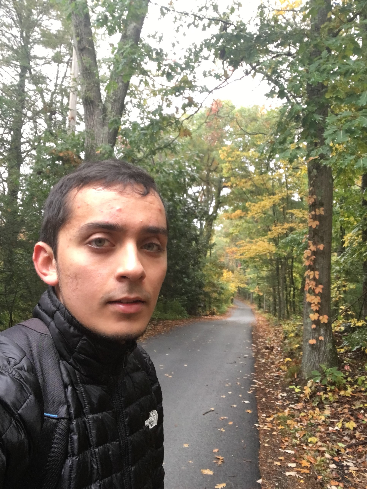

 

I work as a data scientist in drug discovery research at GSK in Cambridge, MA. I think of new ways to use data as we try to get better medicines to patients quicker. I have enjoyed the past [three years](https://www.linkedin.com/in/yusuf-roohani-bb195231/) in industry working in the areas of compound screening, biomarker identification and systems pharmacology modeling. Along the way, I've had some success in designing robust machine learning systems that fit a healthcare context - from discovery all the way to diagnostics. I think artifical intelligence can bridge the many unnecessary divides in the healthcare industry, and I'd like to be a part of that change.

I enjoy the outdoors: I run, bike and swim but have never done a triathlon. I enjoy reading: especially history, historical fiction and tax law. I also enjoy lanugages but am not as good as my wife who speaks at least five.
