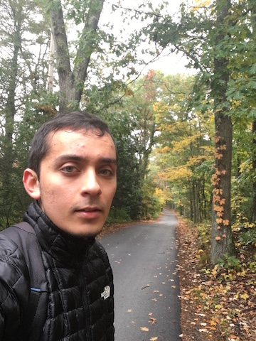

{:height="40%" width="40%"}

I work as a data scientist in drug discovery research at GSK in Cambridge, MA. I think of new ways to use data as we try to get better medicines to patients quicker. My technical interests lie within learning novel representations that are specifically optimised for working across boundaries within biomedical research. 

I have enjoyed the past [three years](https://www.linkedin.com/in/yusuf-roohani-bb195231/) in industry applying these skills towards compound screening, biomarker identification and systems pharmacology modeling. Along the way, I've had some success in designing robust machine learning systems that fit a healthcare context - from discovery all the way to diagnostics.
